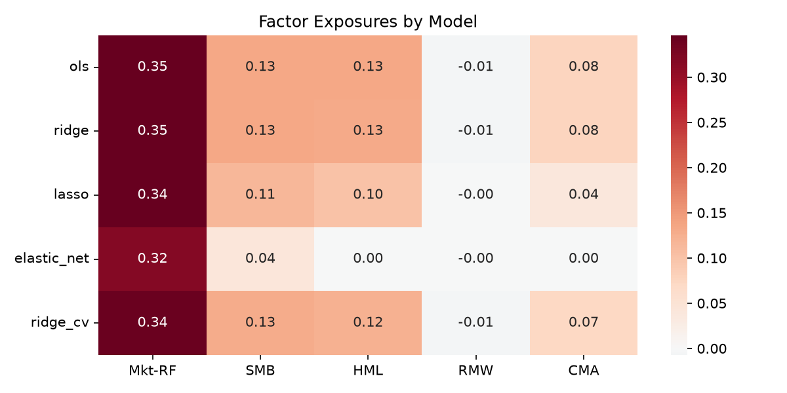
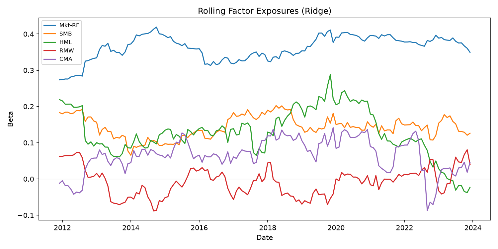
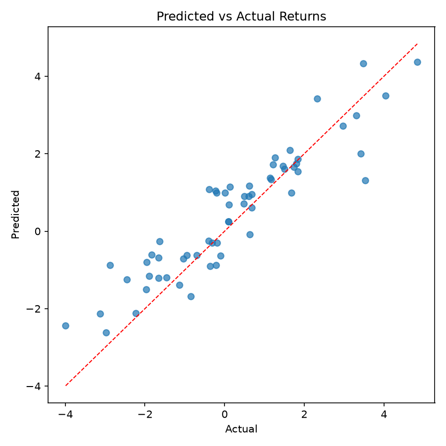
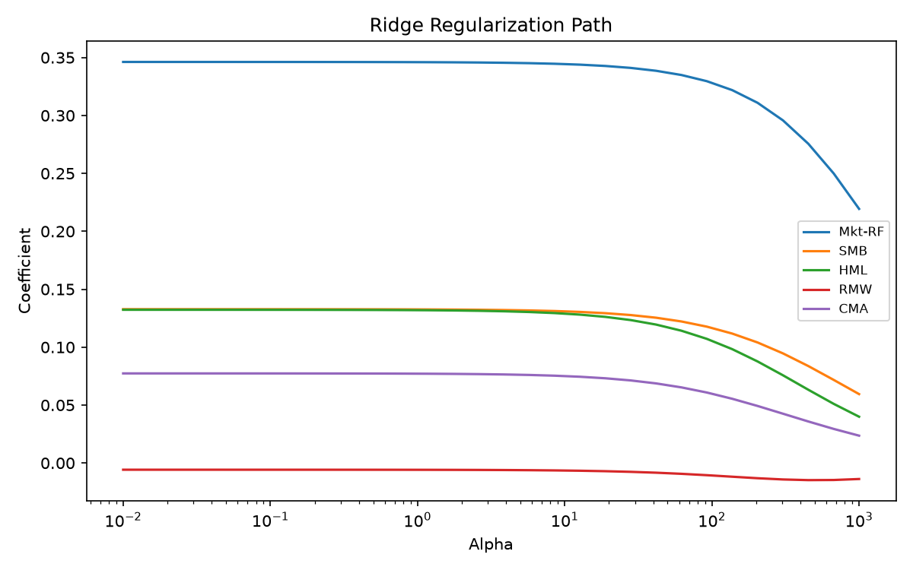
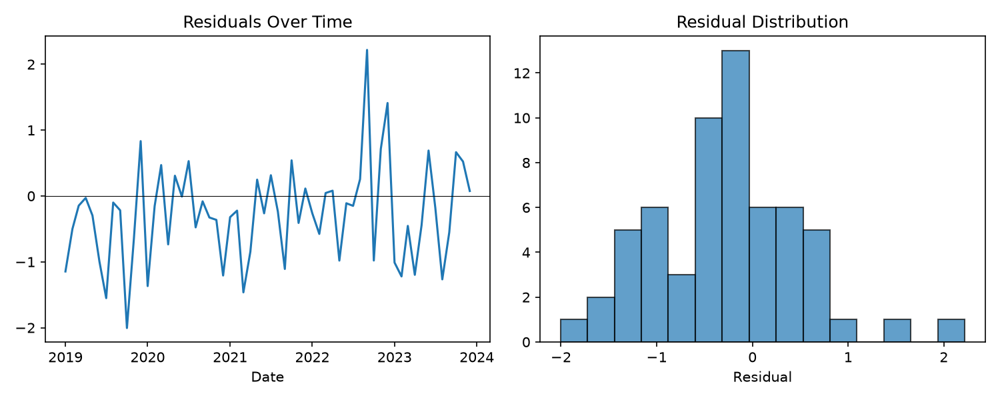

# Hedge Fund Factor Risk Modeling

> A quantitative finance research project modeling hedge fund excess returns using Fama-French factors, regularized regression, rolling factor exposures, and out-of-sample risk attribution.

## Overview

This project estimates hedge fund exposure to systematic risk factors (Mkt-RF, SMB, HML, RMW, CMA), compares regularized regression models, and evaluates out-of-sample stability with time-based validation. It is **not** a trading strategy — it demonstrates the research process behind quantitative finance.

## Research Question

Can hedge fund excess returns be explained by Fama-French factors, and does Ridge regression improve out-of-sample stability compared with OLS?

## Why This Matters

Hedge fund returns often reflect exposure to common risk factors rather than pure manager alpha. This project estimates those exposures, evaluates model stability, and separates factor-driven returns from residual performance.

## Quick Start

### Option A: One-command environment setup (recommended)

```bash
chmod +x scripts/setup_env.sh
./scripts/setup_env.sh          # uses conda if available, otherwise venv
# or explicitly:
./scripts/setup_env.sh conda    # creates .conda-env/
./scripts/setup_env.sh venv     # creates .venv/
```

Activate the environment:

```bash
# conda
conda activate .conda-env

# venv (macOS/Linux)
source .venv/bin/activate
```

The setup script installs all dependencies and the package in editable mode. Environments live in `.conda-env/` or `.venv/` (gitignored, local to your machine).

### Option B: Manual install

```bash
pip install -r requirements.txt
pip install -e .
```

### Run the pipeline

```bash
python -m hedge_fund_factor_modeling.cli prepare-data --config configs/default.yaml
python -m hedge_fund_factor_modeling.cli train --model all --config configs/default.yaml
python -m hedge_fund_factor_modeling.cli evaluate --results results/model_performance.csv
python -m hedge_fund_factor_modeling.cli plot --output assets/
pytest
```

## Methods

- OLS, Ridge, Lasso, Elastic Net, Ridge CV (TimeSeriesSplit), rolling Ridge, expanding Ridge
- Time-based train/test split (no random shuffling)
- Rolling-window and expanding-window Ridge betas
- Out-of-sample evaluation with residual diagnostics
- Factor exposure heatmaps and regularization path analysis

## Results

| Model | Train R² | Test R² | RMSE | MAE | Residual Volatility | Notes |
|---|---:|---:|---:|---:|---:|---|
| OLS | 0.80 | 0.82 | 0.79 | 0.61 | 0.75 | Baseline factor model |
| Ridge | 0.80 | 0.82 | 0.79 | 0.61 | 0.75 | Regularized factor model |
| Lasso | 0.79 | 0.82 | 0.79 | 0.62 | 0.75 | Sparse factor selection |
| Elastic Net | 0.74 | 0.78 | 0.89 | 0.69 | 0.83 | Mixed L1/L2 regularization |
| Ridge CV | 0.80 | 0.82 | 0.80 | 0.62 | 0.75 | Ridge with time-series cross-validation |
| Rolling Ridge | 0.74 | 0.82 | 0.80 | 0.61 | 0.80 | Time-varying factor exposure |
| Expanding Ridge | 0.76 | 0.83 | 0.78 | 0.59 | 0.76 | Expanding-window factor exposure |

*Results above use synthetic sample data (`configs/default.yaml`) so the pipeline is reproducible without private fund files.*

### Real Fama-French factors

Download official factor data and run with real market factors:

```bash
./scripts/download_fama_french.sh
python -m hedge_fund_factor_modeling.cli train --model all --config configs/real_fama.yaml
```

`configs/real_fama.yaml` merges **real Fama-French factors** with the sample fund returns. Replace `fund_returns_path` with your own `FundReturns` file when available. With mismatched synthetic fund data, test R² can be negative — that is expected until real fund returns are plugged in.

## Factor Exposure Analysis



Estimated betas show how each model loads on the Fama-French five factors. Ridge and OLS produce similar exposures on this sample; Lasso can zero out weaker factors.

## Rolling Betas



Rolling Ridge regression reveals how factor exposures evolve over time — a key step before attributing performance or building signals.

## Model Fit and Diagnostics

| Chart | Description |
|---|---|
|  | Out-of-sample predicted vs actual fund returns |
|  | How Ridge coefficients shrink as λ increases |
|  | Unexplained returns after factor attribution |

## Relevance to Quantitative Research

This project is not a trading strategy. It focuses on the research habits needed before turning any signal into a tradable idea:

- No-lookahead checks (time-based splits)
- Rolling-window validation
- Out-of-sample evaluation
- Factor exposure stability
- Residual diagnostics

## Project Structure

```
hedge-fund-factor-risk-modeling/
├── src/hedge_fund_factor_modeling/   # Core package
├── notebooks/                         # Theory + demo notebook
├── configs/default.yaml              # Experiment configuration
├── data/sample/                       # Synthetic data for end-to-end runs
├── results/                           # Model outputs (CSV)
├── assets/                            # Diagnostic plots
└── tests/                             # pytest suite + GitHub Actions CI
```

## Engineering Practices

- Modular Python package with config-driven experiments
- CLI for prepare → train → evaluate → plot
- pytest suite with no-lookahead and alignment tests
- GitHub Actions CI on every push

## Data

See [data/README.md](data/README.md). The repo ships synthetic sample data so the full pipeline runs without private datasets. Download real Fama-French factors from the [Kenneth French Data Library](https://mba.tuck.dartmouth.edu/pages/faculty/ken.french/data_library.html).

## Limitations

- Sample data is synthetic; real fund data may show different factor loadings
- Survivorship bias and small sample issues not addressed
- Factor returns assumed stationary; exposures may shift across regimes

## Future Work

- Add more funds and multi-fund panels
- Regime detection and nonlinear models
- Bayesian shrinkage for exposure estimation
- Transaction-cost-aware strategy extension (separate from this research repo)

## License

MIT — see [LICENSE](LICENSE).
